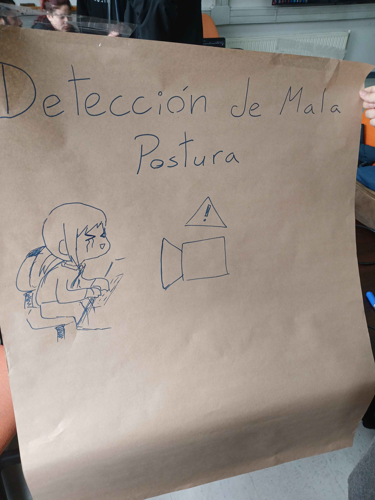

# PosturApp

<!-- WARNING: THIS FILE WAS AUTOGENERATED! DO NOT EDIT! -->

## Problema

La mala postura en entornos laborales es un problema común que afecta a
millones de trabajadores, especialmente aquellos que pasan largas horas
sentados frente a computadores, o aquellos realizando tareas
repetitivas.

Esta mala postura al sentarse puede generar problemas de salud a largo
plazo, como dolor de espalda, cuello, hombros, trastornos
musculoesqueléticos y fatiga, lo que influye en la productividad y el
bienestar general de los empleados.

## Solución

<figure>

<figcaption aria-hidden="true">Afiche de proyecto</figcaption>
</figure>

El proyecto **PosturApp** consiste en un sistema que, a través de una
webcam, detecta la mala postura del usuario, y envía una alerta al
usuario para recordarle mejorar su postura.

### Funcionamiento

El software escanea constantemente la imagen obtenida por la cámara,
utilizando el modelo entrenado con las imágenes de posturas para
identificar si la postura del sujeto presente en la imagen tiene o no
buena postura.

Si la postura es reconocida como buena, el software sólo continúa
analizando la imagen.

Si la postura es identificada como mala, se envía una alerta al usuario
para corregir.
